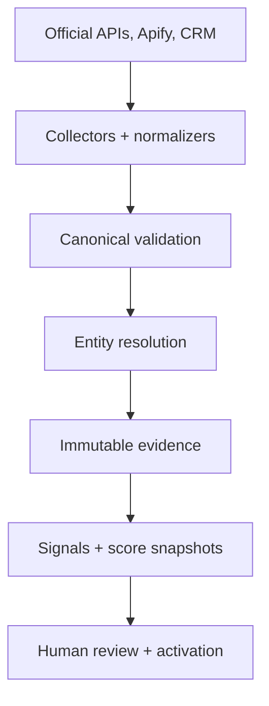
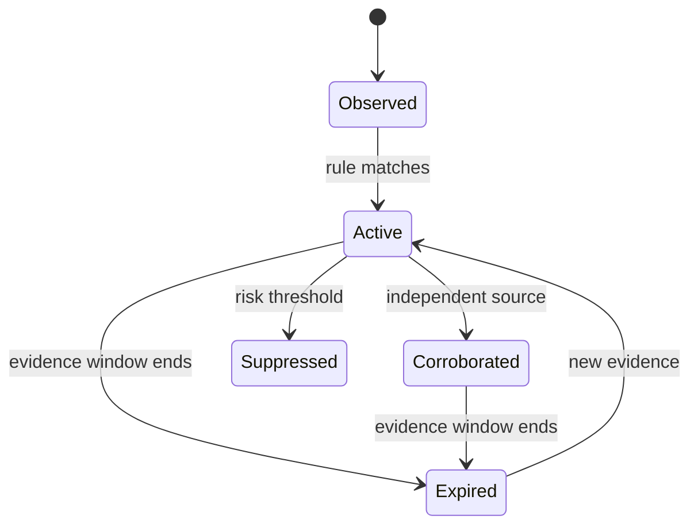

# System Architecture

## Product boundary

The Opportunity Radar answers five operational questions:

1. Which company changed?
2. What happened, and when did it happen?
3. Why does that create a plausible Hook Point or Hyper Ads need?
4. How strong, recent and independently supported is the inference?
5. Should a human act, keep monitoring, or suppress outreach?

It is an evidence and prioritization layer—not a claim that an account formally requested services, a source-license bypass, or an autonomous mass-outreach tool.

## Data flow

Every provider terminates at the same observation contract. Provider code cannot write scores directly.

## Storage model

| Table | Responsibility |
|---|---|
| `tenants` | Tenant boundary and settings |
| `api_keys` | Pepper-HMAC key hashes, scopes, use and revocation |
| `companies` | Canonical account, identity confidence and current score |
| `company_aliases` | Historical names, domains, CRM and LinkedIn identifiers |
| `company_source_identities` | Source-scoped name evidence without unsafe cross-source merging |
| `entity_resolution_events` | Match method and confidence lineage |
| `people` | Sourced buyer/contact candidates |
| `observations` | Immutable normalized facts and event-time lineage |
| `ingestion_rejections` | Payload-free validation/error telemetry |
| `signals` | Current inferred conditions and bounded contribution |
| `signal_evidence` | Proof links between signals and observations |
| `score_snapshots` | Versioned score history and component values |
| `recommendations` | Offer, rationale and guarded next action |
| `lead_events` | Tier and workflow transitions |
| `outcomes` | Human labels, funnel outcomes and revenue feedback |
| `connectors` | Configuration, cadence, failures and backoff |
| `connector_runs` | Counts, durations, errors, cursors and safe usage metadata |
| `webhook_receipts` | Short-lived signature hashes for replay prevention |
| `audit_events` | Administrative and mutation audit trail |

Schema migrations are monotonic and applied during database open. Version 2 adds lineage/rejection/connector reliability fields and removes legacy placeholder records; version 3 adds scoring history; version 4 enforces provider-ID uniqueness and adds replay receipts; version 5 adds source-scoped identity evidence; version 6 adds review, freshness, active-signal and scheduling indexes.

## Entity resolution

Resolution proceeds conservatively:

1. CRM identifier
2. Exact canonical or alias domain
3. Exact LinkedIn company URL
4. Exact normalized name plus matching location
5. Exact normalized name previously seen from the same source, marked low confidence
6. New company record

Name alone never merges companies across independent sources. An alias match never replaces the canonical domain. Ambiguous/low-confidence identities remain visible in `/api/v1/review-queue`. Fuzzy merging is intentionally absent because a false merge contaminates every downstream score and sales action.

## Evidence and scoring

Signals are unique by tenant, company and signal key. Evidence remains separate so repeated facts do not create duplicate signals. Only evidence inside twice the signal half-life contributes to evidence/source counts and aggregate confidence.

`config/scoring.json` versions portfolio-level weights, thresholds, corroboration limits and refresh intervals. `config/signal-catalog.json` versions individual rule semantics. Every material recalculation creates a `score_snapshots` row. Accounts below 0.8 identity confidence are capped at `watch` and receive an identity-verification hold even if their numerical score would otherwise qualify as warm or hot.

Suppression is a safety override. A risk-triggered company receives an `Outreach paused` recommendation, and rejected, lost, disqualified or customer accounts cannot retain a sales recommendation.

## Connector lifecycle

Pull connectors execute with a single-process run lock, input-size and result-size bounds, provider timeouts, GET retry/backoff, isolated normalization failures and per-record ingestion failures. A run can be `succeeded`, `partial`, `failed` or `abandoned`. Repeated run failures create exponential backoff up to 24 hours. Successful/partial provider cursors are injected into the next run unless explicitly overridden or reset.

Provider secrets come only from environment/managed secret storage. Persisted schedule input is recursively checked for credential-like fields, and run metadata is recursively redacted.

The scheduler scans all tenants, skips push/manual sources, requires non-secret schedule input and refreshes a bounded batch of due scores so time decay is applied without new evidence. It is appropriate only for one application process; serverless or multi-replica deployments require a durable queue/cron worker.

## Refresh economics

| Monitoring tier | Default interval | Typical source use |
|---|---:|---|
| Universe | 30 days | Registries, websites, Maps |
| Qualified | 7 days | News, jobs, technology, reviews |
| Watchlist | 1 day | Ads, social, search, CRM |
| Hot | 6 hours | First-party intent and campaign movement |

Start broad with cheap sources. Spend on ads, social, traffic and enrichment only after an account has basic fit or a meaningful trigger.

## Deployment scope

The included SQLite/WAL database is suitable for a controlled single-instance service with a durable volume, backups and restore tests. It is not suitable for Vercel function-local storage or multiple concurrent replicas.

Scale replacements should preserve the canonical observation and API contracts:

| Included component | Scale replacement |
|---|---|
| SQLite/WAL | Neon/Postgres operational store |
| In-process scheduler | Vercel Cron/Queues, Temporal or managed workers |
| In-memory rate limit | Upstash Redis or gateway limit |
| Local raw references | Governed object storage |
| Long-lived API keys | SSO plus short-lived tenant credentials |
| Direct rescoring | Queue-backed workers and batch analytics |

The Vercel adapter intentionally fails readiness when it detects ephemeral production storage. This prevents a successful-looking connector run from writing records that disappear after a cold start.
